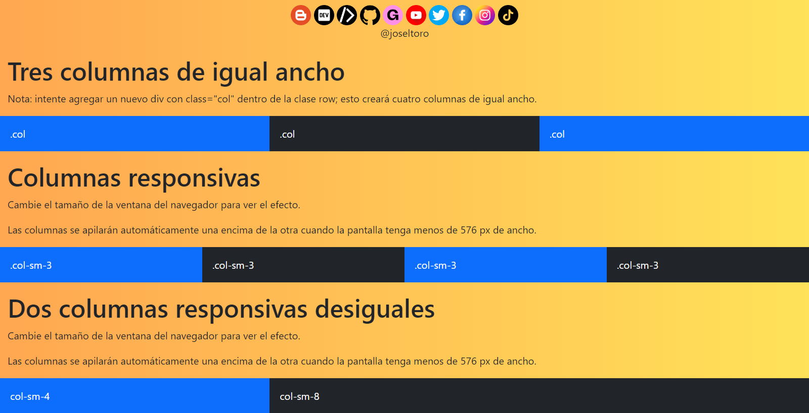
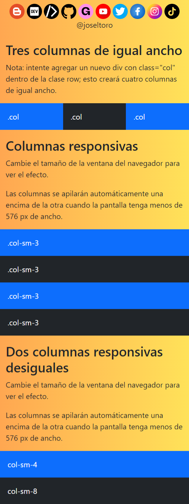

# Bootstrap 5 | Grid Basic

📒 Sistema de cuadrícula Bootstrap 5

    📝 El sistema de cuadrícula de Bootstrap está construido con flexbox y permite hasta 12 columnas en la página.
    📝 Si no desea usar las 12 columnas individualmente, puede agrupar las columnas para crear columnas más anchas:
    📝 El sistema de cuadrícula responde y las columnas se reorganizarán automáticamente según el tamaño de la pantalla.
    📝 Asegúrese de que la suma sume 12 o menos (no es necesario que use las 12 columnas disponibles).

📒 Clases de cuadrícula

    📝 El sistema de cuadrícula Bootstrap 5 tiene seis clases:

        🔸 .col- (dispositivos extra pequeños - ancho de pantalla inferior a 576 px)
        🔸 .col-sm- (dispositivos pequeños - ancho de pantalla igual o mayor a 576px)
        🔸 .col-md- (dispositivos medianos - ancho de pantalla igual o mayor a 768px)
        🔸 .col-lg- (dispositivos grandes - ancho de pantalla igual o mayor a 992px)
        🔸 .col-xl- (dispositivos extragrandes - ancho de pantalla igual o superior a 1200 px)
        🔸 .col-xxl- (dispositivos extra extra grandes - ancho de pantalla igual o mayor a 1400px)

    📝 Las clases anteriores se pueden combinar para crear diseños más dinámicos y flexibles.
    📝 Sugerencia: cada clase se amplía, por lo que si desea establecer los mismos anchos para sm y md, solo necesita especificar sm.

📒 Estructura básica de una cuadrícula Bootstrap 5

    📝 La siguiente es una estructura básica de una cuadrícula de Bootstrap 5:

        <!-- Controle el ancho de la columna y cómo deben aparecer en diferentes dispositivos -->
        

            

            

        

        

            

            

            

        

        <!-- O deja que Bootstrap maneje automáticamente el diseño -->
        

            

            

            

        

    📝 Primer ejemplo: crea una fila (
). Luego, agregue el número deseado de columnas (etiquetas con las clases .col-*-* apropiadas). La primera estrella (*) representa la capacidad de respuesta: sm, md, lg, xl o xxl, mientras que la segunda estrella representa un número, que debe sumar 12 para cada fila.
    📝 Segundo ejemplo: en lugar de agregar un número a cada columna, deje que Bootstrap maneje el diseño para crear columnas de igual ancho: dos elementos "col" = 50% de ancho para cada columna, mientras que tres columnas = 33.33% de ancho para cada columna. Cuatro columnas = 25% de ancho, etc. También puede usar .col-sm|md|lg|xl|xxl para hacer que las columnas respondan.

📒 Ejercicios

    📝 Tres columnas iguales
    
        El siguiente ejemplo muestra cómo crear tres columnas de igual ancho, en todos los dispositivos y anchos de pantalla:
        
        

            
.col

            
.col

            
.col

        

    📝 Columnas responsivas
    
        El siguiente ejemplo muestra cómo crear cuatro columnas de igual ancho comenzando en tabletas y escalando a escritorios extra grandes. En teléfonos móviles o pantallas de menos de 576 px de ancho, las columnas se apilarán automáticamente una encima de la otra:

        

            
.col-sm-3

            
.col-sm-3

            
.col-sm-3

            
.col-sm-3

        

     📝 Dos columnas responsivas desiguales

        El siguiente ejemplo muestra cómo obtener dos columnas de varios anchos comenzando en tabletas y escalando a grandes escritorios adicionales:
        
        

            
.col-sm-4

            
.col-sm-8

        

Redes sociales:

- https://instagram.com/dev.joseltoro
- https://facebook.com/devjoseltoro
- https://tiktok.com/@dev.joseltoro
- https://dev.to/joseltoro
- https://code.dcoder.tech/profile/joseltoro
- https://joseltoro.blogspot.com/
- https://joseltoro.gumroad.com/